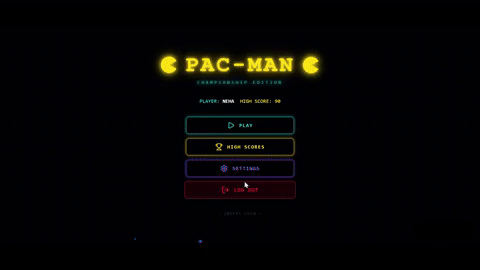

# Pac-Man in C

A Pac-Man clone built in C, featuring two versions:
- **Console version** — built entirely from scratch
- **GUI version** — interface layer built with AI-tool assistance, then studied and modified

---

## Demo

## Console Version

### Features

**User Accounts & Login**
- Username/password login system on startup
- New users are created automatically on first login; returning users are authenticated against stored credentials
- Passwords are masked with `*` during input, with backspace support

**Persistent High Scores**
- Each user has their own top-5 high score list
- Scores update automatically at the end of a game if the new score qualifies
- High scores display on-screen at the top of every frame

**Multiple Maze Layouts**
- 3 distinct levels, each with a different procedurally-drawn maze pattern (vertical corridors, cross-shaped walls, and a checkerboard-style maze)
- Level progression triggers automatically once all food is collected or a score threshold is hit

**Core Gameplay**
- Grid-based movement (15×10) with wall-collision checking in all 4 directions
- Food pellets that increase score on collection and track remaining count per level
- A ghost with randomized movement that respects wall boundaries
- Collision detection between Pac-Man and the ghost, ending the round

**Real-Time Input Handling**
- Non-blocking keyboard input via `_kbhit()` / `_getch()`, so the game loop keeps running (ghost movement, rendering) even without player input
- Game loop runs on a fixed tick via `Sleep()` for consistent pacing

**Game Over / Restart Flow**
- On collision with the ghost, score is saved and the player can restart or quit
- On completing all 3 levels, a win message is shown

### Built With
- C (standard library)
- `conio.h` / `windows.h` for terminal input handling (Windows-only)

### Known Limitations
- Passwords are stored in plain text in memory (not hashed) — not suitable for real-world use, noted here as a learning project limitation
- `scanf("%s", ...)` is used for username input without a length limit
- Windows-only due to `conio.h` / `windows.h` dependency

---

## GUI Version

Interface layer built using an AI-powered development tool, then reviewed and adapted to understand the underlying logic (rendering, event handling, collision detection).

*(Add specifics here: which library/tool was used, what the interface looks like, what you changed or learned from the generated code.)*

---

## What I Learned
- Structuring a real-time game loop from scratch (input, update, render cycle)
- Grid-based collision detection and coordinate math
- Managing user state and persistent data across game sessions
- Reading, understanding, and adapting AI-generated code rather than using it as a black box
